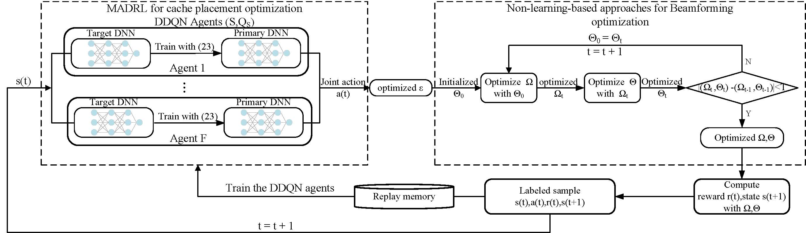

# FoV-MEC-DRL
codes for "Cooperative Caching, Rendering and Beamforming for RIS-assisted Wireless Virtual Reality Networks"

## Environments

python=3.6.0

numpy=1.24.4

tensorflow-gpu=1.14.0 +cuda=11.3

scipy=1.10.1

matlab 2020b

matlab.engine for python

CVX Tool for Matlab2020b

## The DRL model implementation 

The implementation is in `DRL/model_train.py`